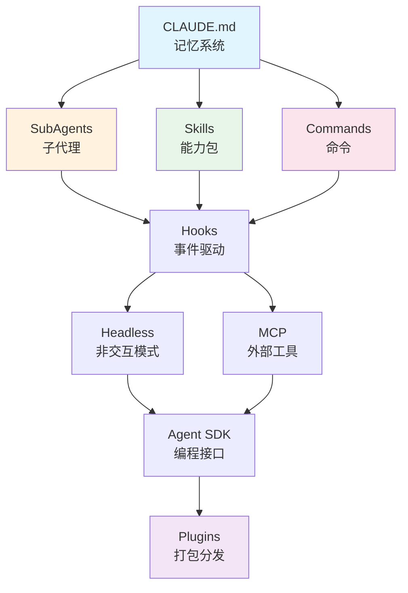

# Claude Code 工程化实战 · 仓库深度走读报告

> **分析日期**: 2026-03-01
> **仓库**: D:\workspace\claude-code-engineering
> **读者**: 开发者
> **分析范围**: 全面分析

---

## 目录

1. [执行摘要](#执行摘要)
2. [Phase 1：全局架构地图](#phase-1全局架构地图)
3. [Phase 2：核心入口与执行流程](#phase-2核心入口与执行流程)
4. [Phase 3：核心模块深挖](#phase-3核心模块深挖)
5. [Phase 4：上手实操与二次开发](#phase-4上手实操与二次开发)
6. [Phase 5：配置文件格式规范](#phase-5配置文件格式规范)
7. [Phase 6：评分与改进建议](#phase-6评分与改进建议)

---

## 执行摘要

### 仓库定位

这是极客时间专栏《Claude Code 工程化实战》的配套代码仓库，系统性地展示了 Claude Code 的高级功能和工程化实践。

### 核心价值

| 维度 | 评估 |
|------|------|
| **学习价值** | ⭐⭐⭐⭐⭐ 行业首个系统性 Claude Code 工程化教程 |
| **实用性** | ⭐⭐⭐⭐⭐ 可直接复用的 Agent/Skill/Command 模板 |
| **完整性** | ⭐⭐⭐⭐ 覆盖 10 大主题，6 章已发布 |
| **代码质量** | ⭐⭐⭐⭐ 结构清晰，注释完整 |

### 技术栈关系图

```
                    ┌──────────────┐
                    │   Plugins    │  容器（打包分发）
                    └──────┬───────┘
                           │
        ┌──────────────────┼──────────────────┐
        │                  │                  │
        ▼                  ▼                  ▼
┌──────────────┐  ┌──────────────┐  ┌──────────────┐
│   Commands   │  │    Skills    │  │     MCP      │
│  用户触发 /xxx│  │  自动发现    │  │  外部工具     │
└──────────────┘  └──────────────┘  └──────────────┘
        │                  │                  │
        └──────────────────┼──────────────────┘
                           │
                           ▼
                    ┌──────────────┐
                    │    Hooks     │  事件驱动控制
                    └──────────────┘
                           │
        ┌──────────────────┼──────────────────┐
        ▼                  ▼                  ▼
┌──────────────┐  ┌──────────────┐  ┌──────────────┐
│  SubAgents   │  │   Memory     │  │  Headless    │
│  任务分发     │  │  上下文持久   │  │  非交互执行   │
└──────────────┘  └──────────────┘  └──────────────┘
                           │
                           ▼
                    ┌──────────────┐
                    │  Agent SDK   │  编程式访问
                    └──────────────┘
```

---

## Phase 1：全局架构地图

### 1.1 目录结构概览

```
D:\workspace\claude-code-engineering\
├── 01-Introduction/          # 第 1 讲：全景导览
│   └── README.md
├── 02-Memory/                # 第 2 讲：CLAUDE.md 记忆系统
│   └── projects/
│       ├── 01-web-app/       # React 电商前端示例
│       └── 02-api-service/   # API 服务示例
├── 03-SubAgents/             # 第 3-6 讲：子代理专题
│   └── projects/
│       ├── 01-code-reviewer/ # 只读型代码审查器
│       ├── 02-test-runner/   # 测试运行器
│       ├── 03-log-analyzer/  # 日志分析器
│       ├── 04-parallel-explore/ # 并行探索
│       ├── 05-bugfix-pipeline/ # Bug 修复流水线
│       └── 06-agent-teams-bug-hunt/ # Agent Teams 协作
├── 04-Skills/                # 第 7-9 讲：Skills 技能系统
│   └── projects/
│       ├── 01-basic-skill/   # 基础 Skill 结构
│       ├── 01-reference-skill/ # 引用型 Skill
│       ├── 02-progressive-skill/ # 渐进式披露
│       ├── 03-financial-skill/ # 财务分析 Skill
│       ├── 04-api-generator/ # API 生成器
│       ├── 05-agent-skill-combo/ # Agent + Skill 组合
│       ├── 06-codebase-visualizer/ # 代码可视化
│       ├── 07-skill-fork-demo/ # Skill Fork 模式
│       └── 08-skill-pipeline/ # 多 Stage 流水线
├── 05-Commands/              # 第 10 讲：自定义命令
│   └── projects/
│       ├── 01-basic-commands/ # 基础命令集
│       └── 02-advanced-commands/ # 高级命令
├── 06-Hooks/                 # 第 11 讲：钩子（即将上线）
├── 07-MCP/                   # 第 12 讲：MCP 协议（即将上线）
├── 08-Headless/              # 第 13 讲：Headless 模式（即将上线）
├── 09-Agent-SDK/             # 第 14-15 讲：Agent SDK（即将上线）
├── 10-Plugins/               # 第 16 讲：插件打包（即将上线）
├── 91-Pictures/              # 课程图片资源
├── CLAUDE.md                 # 项目级记忆文件
└── README.md                 # 仓库说明
```

### 1.2 章节发布状态

| 章节 | 主题 | 状态 | 项目数 |
|------|------|------|--------|
| 01 | 全景导览 | 已发布 | 0 (README only) |
| 02 | Memory | 已发布 | 2 |
| 03 | SubAgents | 已发布 | 6 |
| 04 | Skills | 已发布 | 9 |
| 05 | Commands | 已发布 | 2 |
| 06 | Hooks | 即将上线 | - |
| 07 | MCP | 即将上线 | - |
| 08 | Headless | 即将上线 | - |
| 09 | Agent SDK | 即将上线 | - |
| 10 | Plugins | 即将上线 | - |

### 1.3 配置文件分布统计

```
.claude/agents/*.md     → 16 个子代理定义
.claude/skills/*/SKILL.md → 11 个 Skill 定义
.claude/commands/*.md   → 7 个命令定义
CLAUDE.md              → 4 个项目记忆文件
settings.json          → 2 个配置文件
```

### 1.4 模块依赖关系



---

## Phase 2：核心入口与执行流程

### 2.1 Claude Code 配置加载链

```
1. 用户启动 Claude Code
   │
   ▼
2. 扫描 .claude/settings.json（全局 + 项目级）
   │
   ▼
3. 加载 CLAUDE.md（项目记忆）
   │
   ▼
4. 扫描 .claude/skills/*/SKILL.md（自动发现）
   │  └─ 根据 description 进行语义匹配
   │
   ▼
5. 注册 .claude/commands/*.md（斜杠命令）
   │
   ▼
6. 注册 .claude/agents/*.md（子代理）
   │
   ▼
7. 用户输入 → Claude 响应
```

### 2.2 Skills 触发机制

```
用户输入
   │
   ▼
Claude 扫描所有 Skill 的 description 字段
   │
   ▼
语义匹配（LLM 推理）
   │
   ├─ 匹配成功 → 加载完整 SKILL.md
   │              │
   │              ▼
   │           按需加载引用资源
   │           (templates/scripts/reference)
   │
   └─ 无匹配 → 正常处理
```

### 2.3 SubAgents 执行流程

```
主对话
   │
   ├─ 单代理调用
   │  │
   │  ▼
   │  派发任务给指定 Agent
   │  │
   │  ▼
   │  Agent 在隔离上下文执行
   │  │
   │  ▼
   │  返回摘要结果给主对话
   │
   ├─ 并行调用（如 04-parallel-explore）
   │  │
   │  ▼
   │  同时派发给多个 Agent
   │  │
   │  ▼
   │  各 Agent 独立执行
   │  │
   │  ▼
   │  主对话综合所有结果
   │
   └─ 流水线调用（如 05-bugfix-pipeline）
      │
      ▼
      Stage 1 → Stage 2 → Stage 3 → Stage 4
      (locator)  (analyzer)  (fixer)   (verifier)
```

### 2.4 Agent Teams 协作流程（06-agent-teams-bug-hunt）

```
┌─────────────────────────────────────────────────────────────┐
│                      Lead Agent                              │
│  (协调、分配任务、综合发现)                                    │
└─────────────────────────────────────────────────────────────┘
         │              │              │              │
         ▼              ▼              ▼              ▼
   ┌──────────┐  ┌──────────┐  ┌──────────┐  ┌──────────┐
   │Teammate 1│  │Teammate 2│  │Teammate 3│  │Teammate 4│
   │ 会话分析  │  │ 性能分析  │  │ 数据流分析│  │ 缓存分析  │
   └──────────┘  └──────────┘  └──────────┘  └──────────┘
         │              │              │              │
         └──────────────┴──────────────┴──────────────┘
                               │
                    共享任务列表 (Ctrl+T)
                    发现共享与挑战
                               │
                               ▼
                    ┌──────────────────┐
                    │   最终综合报告    │
                    └──────────────────┘
```

---

## Phase 3：核心模块深挖

### 3.1 SubAgents 子代理系统

#### 3.1.1 代理定义格式

**文件位置**: `.claude/agents/*.md`

**标准结构**:
```yaml
---
name: agent-name                    # 代理名称
description: 代理职责描述            # 用于自动匹配
tools: Read, Grep, Glob, Bash       # 可用工具列表
model: sonnet | haiku               # 使用的模型
permissionMode: plan                # 权限模式（可选）
skills:                             # 预加载的 Skills（可选）
  - skill-name
---

# 系统提示词
[代理的具体行为指令]
```

#### 3.1.2 代理类型分析

| 代理 | 类型 | 工具权限 | 模型 | 用途 |
|------|------|----------|------|------|
| code-reviewer | 只读型 | Read, Grep, Glob, Bash | sonnet | 代码审查 |
| test-runner | 执行型 | Read, Bash, Glob, Grep | haiku | 测试运行 |
| log-analyzer | 分析型 | Read, Grep, Glob | haiku | 日志分析 |
| bug-locator | 只读型 | Read, Grep, Glob | haiku | Bug 定位 |
| bug-analyzer | 只读型 | Read, Grep, Glob | sonnet | 根因分析 |
| bug-fixer | 写入型 | Read, Edit, Write | sonnet | 修复实施 |
| bug-verifier | 验证型 | Read, Bash, Grep | haiku | 修复验证 |
| api-doc-generator | 写入型 | Read, Grep, Glob, Write, Bash | sonnet | 文档生成 |

#### 3.1.3 设计模式总结

**模式 1：只读安全型**
```
特点：tools 只有 Read, Grep, Glob
场景：代码审查、问题分析
代表：code-reviewer, bug-locator, bug-analyzer
```

**模式 2：高噪声处理型**
```
特点：使用 haiku 模型，只返回摘要
场景：测试运行、日志分析
代表：test-runner, log-analyzer
```

**模式 3：流水线协作型**
```
特点：多个代理按阶段执行，前阶段输出作为后阶段输入
场景：Bug 修复流水线、文档生成流水线
代表：bug-locator → bug-analyzer → bug-fixer → bug-verifier
```

**模式 4：并行探索型**
```
特点：多个代理同时工作，主对话综合
场景：多模块并行分析
代表：auth-explorer, db-explorer, api-explorer
```

### 3.2 Skills 技能系统

#### 3.2.1 Skill 定义格式

**文件位置**: `.claude/skills/*/SKILL.md`

**标准结构**:
```yaml
---
name: skill-name                    # Skill 名称
description: 触发条件描述            # 关键！LLM 用此判断是否触发
allowed-tools:                      # 允许的工具
  - Read
  - Grep
  - Glob
  - Write
  - Bash(python:*)                  # 支持通配符
context: fork                       # 上下文模式（可选）
agent: general-purpose              # 关联的代理类型（可选）
---

# Skill 内容
[具体的工作流程和指令]
```

#### 3.2.2 Skill 架构模式

**模式 1：基础单文件型**
```
.claude/skills/code-reviewing/
└── SKILL.md                        # 所有内容在一个文件
```

**模式 2：渐进式披露型**
```
.claude/skills/api-documenting/
├── SKILL.md                        # 主文件（~100 tokens）
├── PATTERNS.md                     # 模式参考
├── STANDARDS.md                    # 标准规范
├── EXAMPLES.md                     # 示例
├── templates/
│   ├── endpoint.md
│   ├── index.md
│   └── openapi.yaml
└── scripts/
    ├── detect_routes.py
    └── validate_openapi.sh
```

**模式 3：领域知识型**
```
.claude/skills/financial-analyzing/
├── SKILL.md
├── reference/                      # 领域知识库
│   ├── revenue.md
│   ├── costs.md
│   └── profitability.md
├── templates/
│   └── analysis_report.md
└── scripts/
    └── calculate_ratios.py
```

**模式 4：Agent + Skill 组合型**
```
.claude/
├── agents/
│   └── api-doc-generator.md        # 引用 Skill
└── skills/
    └── api-generating/
        └── SKILL.md
```

**模式 5：流水线型**
```
.claude/
├── agents/
│   ├── route-scanner.md   # Stage 1
│   ├── doc-writer.md      # Stage 2
│   └── quality-checker.md # Stage 3
└── skills/
    ├── route-scanning/
    ├── doc-writing/
    └── quality-checking/
```

#### 3.2.3 Skill 触发词分析

| Skill | 触发关键词 |
|-------|-----------|
| code-reviewing | code review, feedback, reviewing changes, code quality |
| api-documenting | document APIs, API reference, endpoint documentation, OpenAPI/Swagger |
| financial-analyzing | revenue, costs, profits, margins, ROI, financial metrics |
| api-generating | create API endpoints, generate route handlers, scaffold REST APIs |
| code-health-check | analyze code quality, find issues, health report |

### 3.3 Commands 命令系统

#### 3.3.1 命令定义格式

**文件位置**: `.claude/commands/*.md`

**标准结构**:
```yaml
---
description: 命令描述                # 显示在 /help
argument-hint: [参数提示]           # 参数说明
allowed-tools: Bash(git:*)          # 预授权工具
model: haiku                        # 指定模型
---

# 命令内容
Create a git commit with message: $ARGUMENTS
```

#### 3.3.2 命令列表

| 命令 | 功能 | 模型 |
|------|------|------|
| /commit | 快速 git 提交 | haiku |
| /review | 代码审查 | sonnet |
| /explain | 代码解释 | sonnet |
| /todo | 任务管理 | sonnet |
| /analyze | 深度分析 | sonnet |
| /pr-create | 创建 PR | sonnet |
| /safe-deploy | 安全部署 | sonnet |

#### 3.3.3 命令特性

**参数传递**:
- `$ARGUMENTS` - 接收所有参数
- `$1`, `$2` - 接收位置参数

**文件引用**:
- `@docs/coding-standards.md` - 嵌入文件内容

**命令执行**:
- `!`git log --oneline -10`` - 嵌入命令输出

**命名空间**:
```
.claude/commands/
├── git/
│   ├── commit.md      →  /git:commit
│   └── push.md        →  /git:push
└── test/
    ├── unit.md        →  /test:unit
    └── e2e.md         →  /test:e2e
```

### 3.4 Memory 记忆系统

#### 3.4.1 CLAUDE.md 结构分析

```markdown
# 项目：[项目名称]

## 技术栈
- 框架 + 版本
- 核心依赖

## 目录结构
[关键目录说明]

## 编码规范
### 组件规范
### 状态管理
### 样式规范

## 常用命令
[开发/构建/测试命令]

## API 集成
[API 配置信息]

## Git 规范
[分支/提交规范]
```

#### 3.4.2 记忆层次

```
~/.claude/CLAUDE.md          # 用户级全局记忆
├── .claude/CLAUDE.md        # 项目级记忆
└── src/**/CLAUDE.md         # 模块级记忆（可选）
```

---

## Phase 4：上手实操与二次开发

### 4.1 环境要求

| 依赖 | 版本 | 用途 |
|------|------|------|
| Claude Code CLI | 最新版 | 核心 |
| Node.js | 18+ | 示例项目 |
| Python | 3.10+ | Agent SDK 示例 |
| Anthropic API Key | - | API 访问 |

### 4.2 快速开始

```bash
# 1. 克隆仓库
git clone <repo-url>
cd claude-code-engineering

# 2. 选择一个项目练习
cd 03-SubAgents/projects/01-code-reviewer

# 3. 启动 Claude Code
claude

# 4. 测试子代理
> 让 code-reviewer 审查一下 src/ 目录的代码质量
```

### 4.3 创建自定义 Agent

**步骤 1**: 创建配置文件
```bash
mkdir -p .claude/agents
touch .claude/agents/my-agent.md
```

**步骤 2**: 编写定义
```markdown
---
name: my-agent
description: 我的自定义代理。用于[具体场景]。
tools: Read, Grep, Glob
model: haiku
---

你是一个 [角色描述]。

## 职责
[具体职责]

## 工作流程
1. 步骤一
2. 步骤二
3. 步骤三

## 输出格式
[期望的输出格式]
```

### 4.4 创建自定义 Skill

**步骤 1**: 创建目录结构
```bash
mkdir -p .claude/skills/my-skill
touch .claude/skills/my-skill/SKILL.md
```

**步骤 2**: 编写 SKILL.md
```markdown
---
name: my-skill
description: [触发条件]。Use when [具体场景]。
allowed-tools:
  - Read
  - Grep
  - Glob
---

# My Skill

[Skill 的详细说明和工作流程]

## Quick Reference
| Task | Resource |
|------|----------|
| [任务] | [资源路径] |
```

**步骤 3**: 添加支持文件（可选）
```
.claude/skills/my-skill/
├── SKILL.md
├── templates/
│   └── output.md
├── scripts/
│   └── helper.py
└── reference/
    └── knowledge.md
```

### 4.5 创建自定义 Command

**步骤 1**: 创建命令文件
```bash
mkdir -p .claude/commands
touch .claude/commands/mycommand.md
```

**步骤 2**: 编写命令
```markdown
---
description: 我的自定义命令
argument-hint: [参数说明]
allowed-tools: Bash(npm:*)
model: haiku
---

执行任务: $ARGUMENTS

## 步骤
1. 步骤一
2. 步骤二
```

### 4.6 常见问题排查

| 问题 | 可能原因 | 解决方案 |
|------|----------|----------|
| Skill 未触发 | description 写法不当 | 使用 "Use when..." 句式 |
| Agent 权限不足 | tools 列表不完整 | 添加需要的工具到 tools |
| 命令不显示 | 文件位置错误 | 确认在 .claude/commands/ 下 |
| CLAUDE.md 未生效 | 文件位置错误 | 确认在项目根目录 |

---

## Phase 5：配置文件格式规范

### 5.1 Agent 定义规范

```yaml
---
# 必填字段
name: string              # 唯一标识符
description: string       # 用于自动匹配的描述

# 可选字段
tools: list               # 默认: 全部工具
model: sonnet | haiku     # 默认: sonnet
permissionMode: string    # 权限模式
skills: list              # 预加载的 Skills
---
```

### 5.2 Skill 定义规范

```yaml
---
# 必填字段
name: string              # 唯一标识符
description: string       # 触发条件描述（关键！）

# 可选字段
allowed-tools: list       # 允许的工具
context: string           # 上下文模式
agent: string             # 关联的代理类型
---
```

**description 编写指南**:
1. 使用 "Use when..." 句式
2. 包含具体触发场景
3. 列出关键词
4. 示例: "Analyze financial data. Use when the user asks about revenue, costs, profits, margins, ROI."

### 5.3 Command 定义规范

```yaml
---
# 可选字段
description: string       # /help 中显示
argument-hint: string     # 参数提示
allowed-tools: list       # 预授权工具
model: sonnet | haiku     # 指定模型
---
```

### 5.4 CLAUDE.md 规范

**推荐结构**:
1. 项目概述
2. 技术栈
3. 目录结构
4. 编码规范
5. 常用命令
6. API/Git 规范

**注意事项**:
- 保持简洁，避免冗余
- 使用代码块展示命令
- 定期更新以反映项目变化

---

## Phase 6：评分与改进建议

### 6.1 综合评分

| 维度 | 分数 | 依据 |
|------|------|------|
| **结构清晰度** | 95/100 | 章节编号有序，目录层次分明 |
| **内容完整性** | 80/100 | 6/10 章已发布，核心内容完整 |
| **代码质量** | 90/100 | 配置文件格式规范，注释完整 |
| **学习价值** | 95/100 | 行业首创，示例丰富 |
| **可复用性** | 90/100 | 模板可直接复用 |
| **文档质量** | 85/100 | README 清晰，部分章节待补充 |
| **工程化程度** | 85/100 | 配置规范，但缺少自动化脚本 |
| **创新性** | 95/100 | 首次系统性展示 Claude Code 工程化 |

**总分: 89/100**

### 6.2 优点总结

1. **系统性完整** - 从 Memory 到 Plugins 覆盖完整技术栈
2. **示例丰富** - 16 个 Agent、11 个 Skill、7 个 Command 可直接参考
3. **渐进式设计** - 从基础到高级，学习曲线平滑
4. **实战导向** - 所有示例均可运行，非纸上谈兵
5. **架构清晰** - 各组件职责明确，关系图直观

### 6.3 改进建议

| 优先级 | 建议 | 影响 |
|--------|------|------|
| 🔴 高 | 加快 06-10 章节内容发布 | 完整性 +10 |
| 🔴 高 | 添加自动化测试脚本验证配置正确性 | 工程化 +5 |
| 🟡 中 | 补充各项目的 package.json/requirements.txt | 易用性 +5 |
| 🟡 中 | 添加 CLAUDE.md 模板生成脚本 | 开发效率 +5 |
| 🟢 低 | 添加英文版 README | 国际化 +5 |
| 🟢 低 | 创建交互式学习路径 | 学习体验 +5 |

### 6.4 学习路径推荐

**路径 A：快速入门（1-2天）**
```
02-Memory → 05-Commands → 03-SubAgents
```

**路径 B：团队协作（3-5天）**
```
02-Memory → 05-Commands → 04-Skills → 03-SubAgents
```

**路径 C：完整进阶（1-2周）**
```
01-Introduction → 02-Memory → 03-SubAgents → 04-Skills → 05-Commands
（等待 06-10 发布后继续）
```

---

## 附录

### A. 文件路径索引

#### Agents（16个）
```
03-SubAgents/projects/01-code-reviewer/.claude/agents/code-reviewer.md
03-SubAgents/projects/02-test-runner/.claude/agents/test-runner.md
03-SubAgents/projects/03-log-analyzer/.claude/agents/log-analyzer.md
03-SubAgents/projects/04-parallel-explore/.claude/agents/api-explorer.md
03-SubAgents/projects/04-parallel-explore/.claude/agents/auth-explorer.md
03-SubAgents/projects/04-parallel-explore/.claude/agents/db-explorer.md
03-SubAgents/projects/04-parallel-explore/.claude/agents/frontend-explorer.md
03-SubAgents/projects/04-parallel-explore/.claude/agents/backend-explorer.md
03-SubAgents/projects/05-bugfix-pipeline/.claude/agents/bug-analyzer.md
03-SubAgents/projects/05-bugfix-pipeline/.claude/agents/bug-fixer.md
03-SubAgents/projects/05-bugfix-pipeline/.claude/agents/bug-locator.md
03-SubAgents/projects/05-bugfix-pipeline/.claude/agents/bug-verifier.md
04-Skills/projects/05-agent-skill-combo/.claude/agents/api-doc-generator.md
04-Skills/projects/08-skill-pipeline/.claude/agents/doc-writer.md
04-Skills/projects/08-skill-pipeline/.claude/agents/quality-checker.md
04-Skills/projects/08-skill-pipeline/.claude/agents/route-scanner.md
```

#### Skills（11个）
```
04-Skills/projects/01-basic-skill/.claude/skills/code-reviewing/SKILL.md
04-Skills/projects/01-reference-skill/.claude/skills/api-conventions/SKILL.md
04-Skills/projects/02-progressive-skill/.claude/skills/api-documenting/SKILL.md
04-Skills/projects/03-financial-skill/.claude/skills/financial-analyzing/SKILL.md
04-Skills/projects/04-api-generator/.claude/skills/api-generating/SKILL.md
04-Skills/projects/05-agent-skill-combo/.claude/skills/api-generating/SKILL.md
04-Skills/projects/06-codebase-visualizer/.claude/skills/codebase-visualizer/SKILL.md
04-Skills/projects/07-skill-fork-demo/.claude/skills/code-health-check/SKILL.md
04-Skills/projects/08-skill-pipeline/.claude/skills/doc-writing/SKILL.md
04-Skills/projects/08-skill-pipeline/.claude/skills/quality-checking/SKILL.md
04-Skills/projects/08-skill-pipeline/.claude/skills/route-scanning/SKILL.md
```

#### Commands（7个）
```
05-Commands/projects/01-basic-commands/.claude/commands/commit.md
05-Commands/projects/01-basic-commands/.claude/commands/explain.md
05-Commands/projects/01-basic-commands/.claude/commands/review.md
05-Commands/projects/01-basic-commands/.claude/commands/todo.md
05-Commands/projects/02-advanced-commands/.claude/commands/analyze.md
05-Commands/projects/02-advanced-commands/.claude/commands/pr-create.md
05-Commands/projects/02-advanced-commands/.claude/commands/safe-deploy.md
```

### B. 参考资源

- [Claude Code 官方文档](https://code.claude.com/docs)
- [Agent SDK 文档](https://platform.claude.com/docs/en/agent-sdk/overview)
- [MCP 协议规范](https://modelcontextprotocol.io)
- [极客时间课程](https://time.geekbang.org/column/intro/101113501)

---

*报告生成时间: 2026-03-01*
*分析工具: Claude Code + repo-deep-dive-report skill*
